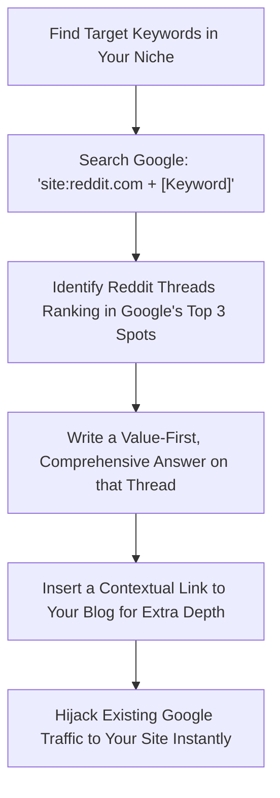

# Research Report: Reddit SEO Integration & Citation Guide

This guide details how to leverage Reddit for search engine optimization (SEO), explains the "Reddit SEO Hack," and outlines next-level citation formats that build search authority and E-E-A-T.

---

## 1. The Reddit SEO Paradigm: Why Reddit Dominates

Following Google's recent Helpful Content Updates (HCU) and Core Updates, search results have fundamentally shifted. Google now heavily favors forum threads—primarily Reddit and Quora—for informational queries.

### The Organic Contract
Google and Reddit established a licensing agreement allowing Google's AI models (Gemini) and search spiders real-time access to Reddit’s data pipeline. Consequently:
- Reddit threads frequently occupy the **top 3 organic spots** or appear in **Discussions and Forums** blocks for informational searches.
- AI Overviews cite Reddit comments directly as trusted sources of human experience.
- Users are appending `"reddit"` to their searches (e.g., *"best productivity app reddit"*) to bypass search engine results pages (SERPs) bloated with affiliate ads.

---

## 2. The Reddit SEO "Traffic Hijack" Hack

The most effective ways to utilize Reddit to rank your website or drive highly qualified referral traffic are split into outbound and inbound strategies.

### Outbound Strategy: The Traffic Hijack
Instead of writing a blog post and waiting months for it to rank, you can "hijacks" existing high-ranking Reddit threads.



1. **Find Ranking Threads**: Search Google using operators like:
   `site:reddit.com "your keyword"` or `site:reddit.com inurl:comments "your keyword"`.
2. **Identify Top 3 Rankers**: Find the threads that are already ranking at the very top of Google for your target keyword.
3. **Provide Value-First Answers**: Do not write spam. Write a multi-paragraph, expert-level response that directly answers the thread's question.
4. **Contextual Link Insertion**: At the end of your answer, naturally insert a link to your website. E.g., *"I wrote a step-by-step mathematical breakdown of this formula here [link] if you want to run the numbers yourself."*
5. **Result**: Because the thread already ranks #1 or #2 on Google, users looking for that keyword click your comment's link, driving immediate high-intent referral traffic to your site.

### Inbound Strategy: The "Clean Hub" Blog
Reddit threads are messy, containing off-topic threads, unverified advice, and formatting limitations.
- **The Hack**: Extract the raw community consensus from a popular Reddit thread, run the mathematical calculations, create structural tables, add expert insights, and publish it on your site as a clean, highly readable blog post.
- **Targeting**: Target the keyword `[Topic] + Reddit` on your own site. By organizing the chaos of a Reddit thread into a professional guide, you capture users searching for real community consensus.

---

## 3. SEO-First Citation Best Practices (E-E-A-T)

When you use Reddit insights or quotes in your blog posts, you must cite them correctly. Citing user-generated content demonstrates to search engines that your content is backed by real-world human experience, satisfying the **Experience** component of Google's E-E-A-T framework.

### The Next-Level SEO Citation Rule
To cite a Reddit source without leaking PageRank authority or losing readers, apply the following HTML standards:

```html
<a href="https://www.reddit.com/r/Subreddit/comments/..." target="_blank" rel="noopener noreferrer nofollow">u/Username</a>
```

- `target="_blank"`: Opens the reference in a new tab. This is crucial for **on-site engagement time**. It keeps your site open in the user's active session, preventing bounce/exit signals.
- `rel="nofollow"`: Instructs search engine bots not to pass PageRank to the external URL. Since Reddit is a massive UGC platform, protecting your link equity (preventing "link leaks") is an SEO best practice.
- `rel="noopener noreferrer"`: A critical security parameter that prevents external tabs from accessing your site's window context and improves performance.

---

## 4. Citation Formats

### Format A: The Web/Blog Standard (Recommended for SEO)
For blog posts, a formal academic format is often too rigid. The best approach is an inline contextual mention followed by a structured references section at the bottom of the article.

#### Inline Contextual Mention
> *"As pointed out by lawncare expert <a href="https://www.reddit.com/user/soilguru" target="_blank" rel="noopener noreferrer nofollow">u/soilguru</a> on the <a href="https://www.reddit.com/r/lawncare/comments/1gsyvn3/calculating_top_soil/" target="_blank" rel="noopener noreferrer nofollow">r/lawncare</a> community board, adding a 10% compaction factor is necessary to avoid settling..."*

#### Styled Sources Footer Section
Place a clean, low-impact list of references at the bottom of your blog page:

```html
<div class="mt-8 pt-6 border-t border-slate-200">
  <h3 class="text-base font-bold text-slate-900">Sources and Community References</h3>
  <ul class="list-disc list-inside space-y-1.5 mt-3 text-sm text-slate-500">
    <li>Reddit Lawncare community discussion on calculating soil requirements: <a href="https://www.reddit.com/r/lawncare/comments/1gsyvn3/calculating_top_soil/" target="_blank" rel="noopener noreferrer nofollow">r/lawncare - Calculating Topsoil</a></li>
  </ul>
</div>
```

---

### Format B: Formal Structured Formats (Academic/Corporate)
If your website requires a formal bibliography (APA or MLA styles), use the following structures:

#### APA 7th Edition Format
- **Structure**: Username. (Year, Month Day). *Title of thread or comment* [Online forum post]. Reddit. URL
- **Example**: u/soilguru. (2026, June 27). *Calculating topsoil volume with compaction factors* [Online forum post]. Reddit. `https://www.reddit.com/r/lawncare/comments/1gsyvn3/calculating_top_soil/`

#### MLA 9th Edition Format
- **Structure**: Username. "Title of thread or comment." *Reddit*, Day Month Year, URL.
- **Example**: u/soilguru. "Calculating topsoil volume with compaction factors." *Reddit*, 27 June 2026, `https://www.reddit.com/r/lawncare/comments/1gsyvn3/calculating_top_soil/`

---

## 5. Summary Guidelines for Future Content
When using Reddit references on Infinix Calculators, check the following:
- [x] Does the outbound link use `target="_blank"`?
- [x] Does the link include `rel="nofollow noopener noreferrer"`?
- [x] Is the Reddit username cited as `u/Username` rather than just anonymous text?
- [x] Does the article conclude with a "Sources and Community References" section?
- [x] Is the content formatted into clean HTML (tables, headings, tilled zones) to offer a better reader experience than the raw Reddit thread?
